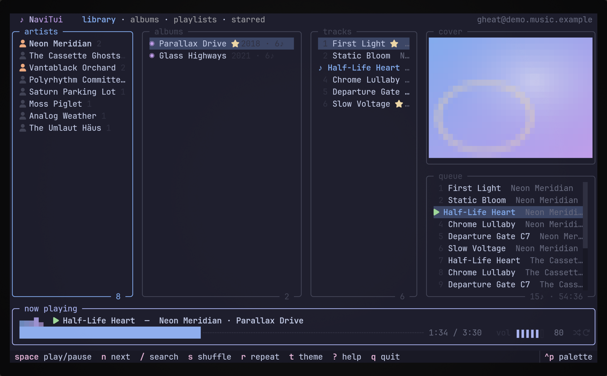
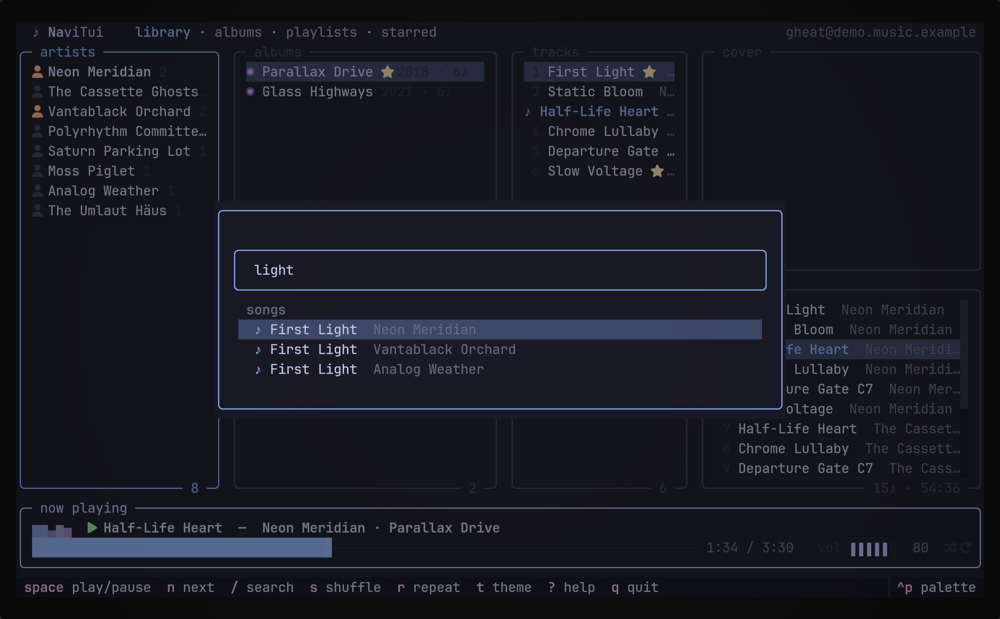
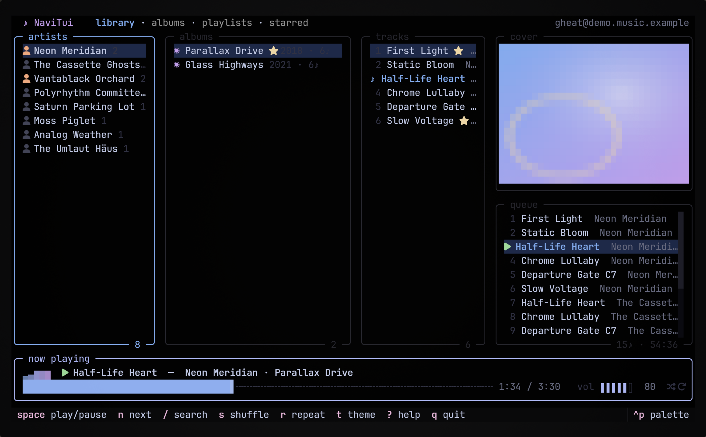

<div align="center">

# ♪ TheIA Player

**A fast, animated terminal player for [Navidrome](https://www.navidrome.org/).**

*This is a custom, optimized fork of [NaviTui](https://github.com/Gheat1/NaviTui) for the TheIA ecosystem.*

Cover art rendered right in your terminal, playback through mpv, five themes
via [ricekit](https://github.com/Gheat1/ricekit) — and everything moves.



</div>

---

## what it does

- **songs first** — no album grids to dig through: one sidebar with all
  tracks / recently added / recently played / most played / starred /
  **shuffle everything**, your playlists right under it, and one big track
  list. Albums and artists still exist — inside search (`/`), where they
  belong
- **playlists you can actually edit** — create one from the sidebar, add
  any track with `p`
- **search that queues** — `enter` plays, `a` queues, `A` slots it right
  after the current song
- **real cover art** — kitty graphics protocol or sixel where available,
  truecolor half-cells everywhere else (`NAVITUI_ART=auto|tgp|sixel|halfcell|unicode|off`)
- **a queue that behaves** — shows what's *up next* (played tracks dim out
  above; scroll up for history), add (`a`), play-next (`A`), remove, clear,
  shuffle that keeps the current track, repeat off/all/one; the queue —
  including your position *inside the current song* — survives a restart
- **alive by default** — the wordmark shimmers, the visualizer pulses with
  playback, the progress bar has 1/8-cell resolution and breathes, long
  titles marquee, panels fade in; all driven by one 8fps heartbeat that
  repaints a handful of cells
- **cache-first** — every pane renders instantly from disk, then refreshes
  silently in the background (auto-refresh every 3 minutes)
- **scrobbles & stars** — now-playing + submission scrobbles at 50%, star and
  unstar songs/albums/artists with `f`
- **full mouse support** — click anything, drag the panel dividers, click the
  progress bar to seek, click the volume gauge, click shuffle/repeat
- **five themes**, live-previewed (`t` cycles, `T` picks) — including `clear`
  (your terminal's transparency shows through) and `system` (your terminal's
  own ANSI palette)
- **10-band equalizer (EQ)** — parametric software equalizer with real-time audio filters (`ctrl+e` / `y` to adjust bands and toggle presets: Bass, Rock, Pop, Vocal, Classical, Electronic, Flat)

<div align="center">


</div>

## install

You need **libmpv** for playback (everything else ships with the package):

```sh
# arch
sudo pacman -S mpv
# debian/ubuntu
sudo apt install libmpv2
# macos
brew install mpv
# windows: put libmpv-2.dll on PATH — https://mpv.io/installation/
```

### 🚀 El camino más rápido (Recomendado con uv)

Si tienes `uv` instalado, puedes instalarlo de forma limpia, aislada e instantánea en tu PATH con un solo comando:

```sh
# macOS (con soporte para teclas físicas de Apple y Centro de Control integrado)
uv tool install --with "pyobjc-framework-MediaPlayer" git+https://github.com/rodmera/theia-player

# Linux / General
uv tool install git+https://github.com/rodmera/theia-player
```

*(O de forma efímera para probarlo en caliente sin instalar nada: `uvx --with "pyobjc-framework-MediaPlayer" --from "git+https://github.com/rodmera/theia-player" theia-player`)*

### Compilación Standalone (Opcional)

Si deseas empaquetar el reproductor en un **único archivo binario ejecutable de Unix autocontenido** (como `fzf` o `ripgrep`), de modo que puedas compartirlo y correrlo en cualquier máquina destino sin depender de que tenga instalado Python o dependencias, ejecuta:

```sh
.venv/bin/python tools/package_mac.py
```
*Generará el ejecutable binario en `dist/theia-player` listo para distribuir.*

## keys

`?` shows everything. The ones you'll use constantly:

| | |
| --- | --- |
| `space` | play / pause |
| `enter` / double-click | play (track, view, playlist) |
| `n` / `b` | next / previous |
| `←` `→` | seek (`shift` for 30s) |
| `a` / `A` | queue / play next (works in search too) |
| `p` | add track to playlists (multi-select) |
| `i` | pin view / highlighted item to favorites (Pins) |
| `c` | ver y copiar detalles/trivia de Spotlight al portapapeles |
| `s` / `r` | shuffle / repeat |
| `f` | star / unstar |
| `N` | toggle notifications (silent mode, muestra `[Silent]` en UI) |
| `/` | search |
| `h` `l` `j` `k` | move around, vim-style |
| `t` / `T` | themes |
| `ctrl+e` / `y` | equalizer (gains and presets) |

## desarrollo y pruebas

El proyecto cuenta con dos suites de pruebas para garantizar el funcionamiento y robustez del reproductor:

### 1. Pruebas Unitarias (`pytest`)
Para validar la lógica pura del reproductor (cola de reproducción, caché de carátulas, conversión de formatos de color como CMYK, normalización de configuraciones, dataclasses de dominio, contrato de `BINDINGS`, driver de audio, guardas de MPRIS, etc.):
```sh
.venv/bin/python3 -m pytest
```

### 2. Pruebas de Integración Visual / Headless (`screenshots.py`)
Para ejecutar una simulación interactiva completa de la TUI en caliente (levantando `mpv` y simulando pulsaciones de teclado) y exportar los assets visuales en SVG:
```sh
.venv/bin/python3 tools/screenshots.py
```

## the suite

- [**ricekit**](https://github.com/rodmera/theia-player/tree/main/ricekit) — El micro-paquete de diseño embebido e integrado localmente en este repositorio para simplificar la instalación y el desarrollo rápido.
- [**ltui**](https://github.com/Gheat1/ltui) — a fast, beautiful TUI for Linear

## license

[MIT](LICENSE) — Fork maintained by [@rodmera](https://github.com/rodmera) (rodrigo@theia.cl). Original design and core implementation by [@Gheat1](https://github.com/Gheat1).
